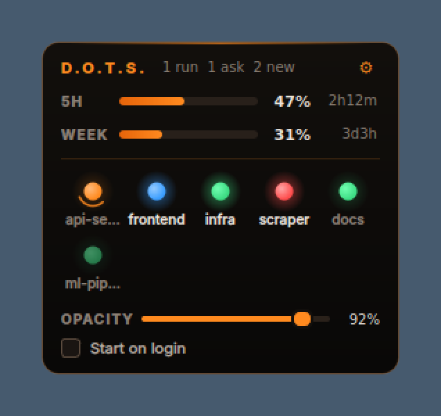

# D.O.T.S.
Digital Overhead Terminal Stalker

A small always-on-top widget with one dot for every Claude Code session you have open, plus your
5-hour and weekly usage meters. Black and orange, draggable, adjustable opacity, and it can start
when you log in.



## What the dots mean

| Dot | Meaning |
|---|---|
| 🟠 orange with a spinning ring | Claude is working |
| 🔵 blinking blue | Claude is waiting for you (permission prompt, a question, plan approval) |
| 🟢 blinking green | Claude finished and you haven't looked yet |
| 🟢 steady green | Finished, already read (or idle) |
| 🔴 blinking red | The turn failed (API error, rate limit, overloaded...). Steady red once read |

**Marking a session as read:** click its dot. That brings its terminal window to the front and
marks it read. On Windows, a finished session also counts as read once you keep its terminal
window focused for 1.5 seconds. This only works when that window holds just that one Claude
session; with several sessions as tabs in one window, click the dot instead.

Hover a dot to see the project, what it's doing, how long ago, the model and how full its context
is. Right-click a dot to open it, mark it read, or remove it. Right-click anywhere else for
"Mark all as read" and Quit. Drag the widget anywhere; it remembers where you put it.
The ⚙ button shows the **opacity slider** and the **start on login** switch.

## Install (Windows, also works on macOS and Linux)

You need Python 3.9 or newer and Claude Code.

```powershell
git clone <this repo> D.O.T.S.
cd D.O.T.S.
py -m pip install -r requirements.txt
py install.py
```

`install.py` does three things:

1. Adds hooks to `~/.claude/settings.json`, so each Claude session reports its state (a backup of
   the file is saved next to it first).
2. Sets the Claude Code status line. This is how the usage meters get their numbers. If you
   already had a status line, it keeps showing; D.O.T.S. just reads the data on the way through.
3. Starts the widget when Windows starts (a `DOTS` entry under
   `HKCU\Software\Microsoft\Windows\CurrentVersion\Run` that runs `pythonw.exe`, so no console
   window opens).

Then **restart your Claude Code sessions** (hooks are read at startup) and start the widget:

```powershell
pyw dots_widget.pyw        # or double-click dots_widget.pyw
```

Other options:

```powershell
py install.py --no-autostart   # skip the start on login entry
py install.py --uninstall      # remove hooks, status line and autostart
py -m dots.demo                # preview the widget with fake sessions
```

Install with the Python that will run the widget. If you use a virtualenv, activate it before you
run `install.py`, because the hooks and autostart entry point at that exact interpreter.

## How it works

```
Claude Code session ──hooks──▶ dots/hook.py ──▶ ~/.dots/sessions/<id>.json ─┐
Claude Code status line ─────▶ dots/statusline.py ──▶ ~/.dots/usage.json ───┼─▶ widget (PySide6)
                                                     ~/.dots/seen.json ◀────┘  (click = read)
```

* **Session state** comes from [Claude Code hooks](https://code.claude.com/docs/en/hooks):
  `UserPromptSubmit`/tool events mean working. `PermissionRequest`, permission notifications and
  the `AskUserQuestion`/`ExitPlanMode` tools mean waiting for you. `Stop` means done,
  `StopFailure` means error, and `SessionEnd` removes the dot. The hook uses only the standard
  library, and the frequent tool events run with `async: true`, so Claude isn't slowed down.
* **Which window to focus:** when you start a session or send a prompt, the hook records the
  terminal window (Windows Terminal, VS Code, conhost...) that owns it.
* **Closed terminals:** the widget checks every few seconds that each session's Claude process is
  still alive and drops dots for sessions whose process has exited.
* **Usage meters** show the `rate_limits` data Claude Code passes to the status line (Pro and Max
  plans). The meters fill in after your first message in any session. Claude has no daily limit:
  the limits are a rolling **5-hour** window and a **weekly** one, so those are the two meters.

## Why Python + PySide6 (Qt)

* Frameless, translucent, always-on-top windows with per-window opacity, a system tray icon and
  smooth custom painting (the glowing and blinking dots) are all built into Qt.
* The same code runs on Windows, macOS and Linux.
* If you'd rather have a single `.exe`: `py -m pip install pyinstaller` then
  `pyinstaller --noconsole --onefile dots_widget.pyw`. The hooks still run with plain Python.

## Troubleshooting

* **No dots:** make sure you restarted Claude Code after installing, and run `/hooks` inside
  Claude Code to check the D.O.T.S. hooks are listed. Hook errors are logged to
  `~/.dots/hook-errors.log`.
* **Meters show `--`:** they fill in after the first response in any session, and only on Pro/Max
  plans.
* **Stuck orange after pressing Esc:** an interrupted turn doesn't send a "stop" event. The dot
  settles after about a minute, when Claude Code reports it's idle.
